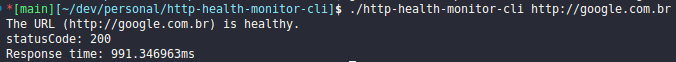
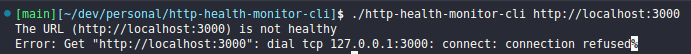

# http-health-monitor-cli

<h1 align="center">
   
  http health monitor cli
</h1>

  

  
  
  

  

 

## 🚀 Techs

Http health monitor cli app was developed with these technologies

- [Go](https://go.dev/)
- [Cobra CLI](https://cobra.dev/)

## 💻 Project

This project is being developed to learn the basics of the Go programming language. It is intended to learn about the Cobra package and other command-line interface (CLI) operations.

### Execution preview

Healthy url

<h1 align="center">
    
</h1>

Connection refused url

<h1 align="center">
    
</h1>
